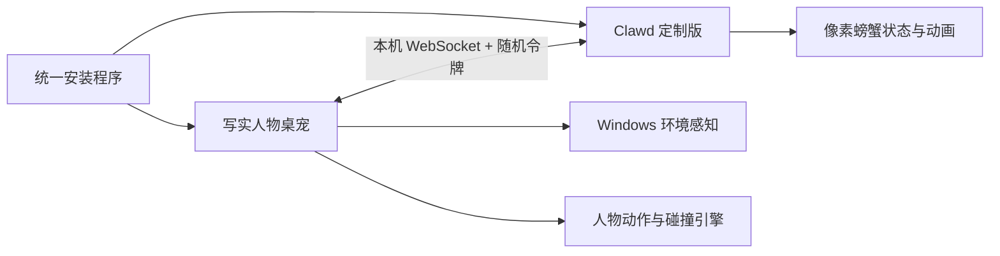
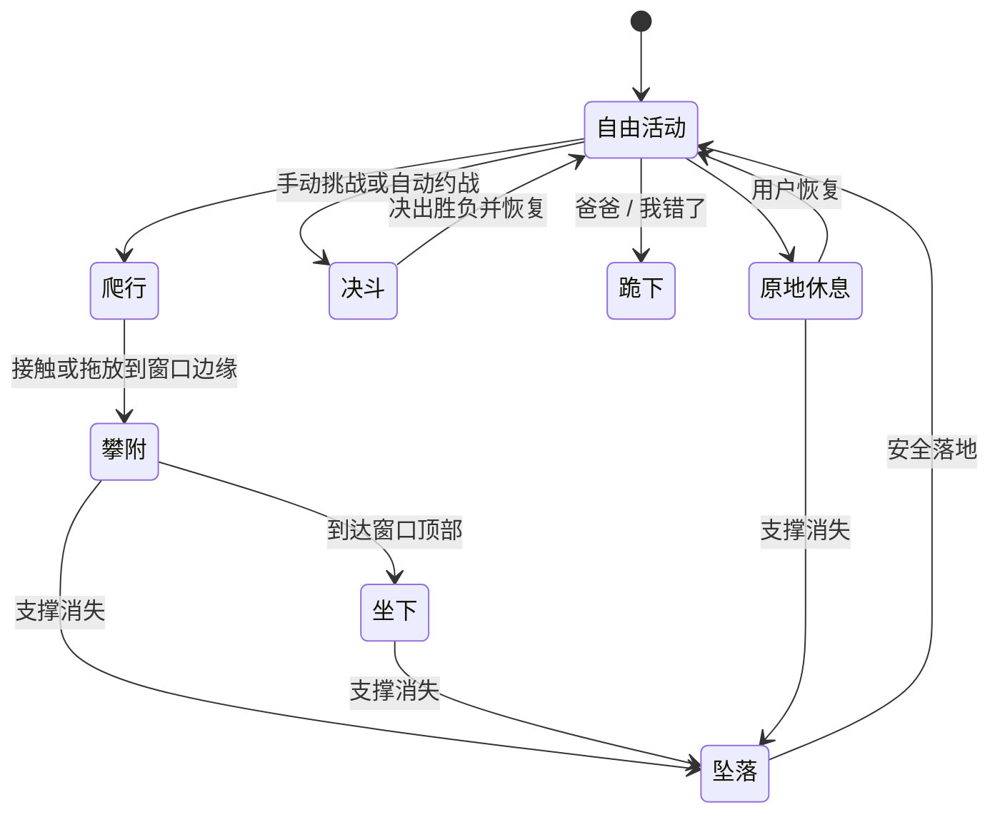

# Windows 写实丑萌桌面宠物与 Clawd 决斗设计

## 1. 项目目标

创建一个兼容 Windows 10/11 x64 的桌面宠物套件。套件包含写实人物桌宠、Clawd on Desk 定制版和本地决斗桥，通过一个统一安装程序交付。

人物桌宠必须忠实保留参考照片中可见的真实外貌、体型、发型、眼镜、白色头戴耳机、卡其色连帽卫衣、灰色运动裤和白色鞋子，不做磨皮、瘦脸、增高、瘦身、放大眼睛或英雄化处理。整体气质为“原貌呆萌”：人体结构与运动力学正常，笑点来自面无表情、慢半拍、突然停顿和笨拙反应。

人物可以在桌面爬行、与窗口及桌面图标碰撞、依附窗口边缘、在支撑消失时坠落，并与 Clawd 像素螃蟹进行同步的非血腥滑稽决斗。

## 2. 已确认的参考素材

人物最终参考仅使用以下两张照片，早期的健壮人物、黑色背心照片和旧正脸照片全部作废：

- `E:\软件下载\WeChat\聊天记录\xwechat_files\wxid_9g5qqj6925yk22_d453\temp\RWTemp\2026-08\446aa628c8b3b4585efd5a133c72d596\d998e748f7303f2204e244966dc13340.jpg`
- `E:\软件下载\WeChat\聊天记录\xwechat_files\wxid_9g5qqj6925yk22_d453\temp\RWTemp\2026-08\446aa628c8b3b4585efd5a133c72d596\f4b2e93722416345fbb4fca30cacf02a.jpg`

第一张照片带有“轻颜”水印。项目只能保证不再额外美颜，不能可靠还原照片处理前的外貌。两张成片中共同可见的外貌作为最终还原标准。

微信临时目录不是稳定素材库。实施开始后必须先把两张原图非破坏性复制到项目受控的 `assets/source/person/`，记录 SHA-256，并始终保留原文件；所有抠图、补全和动画生产只操作副本。

Clawd 源码仓库位于 `E:\02_CodeBase\Fun\clawd-on-desk`。设计确认时仓库版本为 `0.16.0`、提交 `c654e8da`，`main` 与 `origin/main` 同步且工作区干净。后续定制不得直接修改 `main`，应使用 `codex/desktop-pet-duel` 分支。

## 3. 范围与非目标

### 3.1 范围

- Windows 10/11 x64 安装、升级和卸载。
- 写实透明人物动画、自然爬行、窗口攀附和坠落。
- 鼠标拖拽、右键菜单、粉色气泡和 Windows 中文语音合成。
- 应用窗口、任务栏、屏幕边界和桌面快捷方式图标的碰撞。
- Clawd 定制版及双方同步决斗。
- 单显示器、多显示器和不同 DPI 缩放。
- 默认随 Windows 自动启动，可在设置中关闭。

### 3.2 非目标

- 不控制或修改窗口中的业务内容。
- 不上传人物照片、桌面布局、窗口标题或运行日志。
- 不提供血液、伤口、肢解或真实暴力表现。
- 不在运行时调用云端 AI 生成动画。
- 不公开分发 Clawd 自带美术资源；若未来公开发布定制版，需另行完成 AGPL 源码义务和素材授权审查。

## 4. 总体架构

系统保留两个独立桌宠进程，由统一安装程序和本地决斗桥协调：

### 4.1 写实人物桌宠

负责人物渲染、动画状态机、碰撞、窗口依附、拖拽、右键菜单、气泡、语音和决斗编排。它是决斗桥的协调端，但 Clawd 不可用时仍可独立运行。

### 4.2 Clawd 定制版

保留现有 AI Agent 状态、主题、设置和自由漫游能力，增加决斗桥客户端、决斗状态和像素小木刀动画。AI 工作状态优先于自动决斗，不能因娱乐动作丢失思考、执行、权限或完成提示。

### 4.3 本地决斗桥

桥接服务只绑定 `127.0.0.1`。首次运行生成高熵随机令牌，保存在当前 Windows 用户可读的配置目录中。每条消息包含协议版本、会话 ID、递增序号和令牌，拒绝过期、重复、越序或未认证消息。

桥接状态至少包含：

- 双方窗口边界、角色有效碰撞框、朝向和空闲/忙碌状态。
- 邀请、接受、拒绝、取消和冷却时间。
- 靠近目标、就位、攻击、格挡、闪避、受击、胜利、失败和恢复。
- 当前动作 ID、开始时间、预计持续时间和同步检查点。

断线或任一进程退出时，双方必须停止攻击并恢复安全空闲姿势。

## 5. 人物视觉与动画生产

采用动作参考驱动的离线渲染动画方案。构建阶段根据两张人物照片建立保持原始比例的角色，使用真人动作参考或动作捕捉驱动，再渲染为带透明通道的动画序列。运行时只播放已验证素材，不实时生成身体。

素材优先使用支持完整 Alpha 的 APNG 或无损 WebP；每个动作统一画布、锚点、脸部框、身体碰撞框、手脚接触点和支撑点元数据。目标播放速度为 30 FPS；慢速静止状态可以降低刷新率。

必须制作并验证以下动作族：

- 空闲、发呆、观察、转向和恢复。
- 起爬、循环爬行、停爬和转身。
- 向上/向下攀爬、左右侧壁移动、抓壁和悬挂。
- 窗口顶部坐姿、趴姿和双腿悬空姿势。
- 开始坠落、空中下落、落地缓冲和起身。
- 拖拽中的提起姿势及不同落点的吸附过渡。
- 跪下、说话、停顿和恢复。
- 拿出拖鞋、挑战、试探、追逐、攻击、格挡、闪避、受击、胜利和失败。
- 原地休息需要冻结任意当前动画帧，不另做固定休息动作。

动画可以在节奏和表演上丑萌，但不得出现多余肢体、手脚畸形、关节反向、身体穿插、无接触滑行或不合理重心。

## 6. Windows 环境感知与碰撞

### 6.1 应用窗口

使用 Win32 顶层窗口枚举和 DWM 扩展边界取得可见窗口的屏幕矩形。过滤不可见、透明占位、已 cloaked、桌宠自身以及不应参与碰撞的系统辅助窗口。

通过 WinEventHook 监听窗口创建、移动、缩放、最小化、恢复和销毁。轮询仅作为事件遗漏时的低频校正，避免持续高频扫描。

### 6.2 桌面图标

优先从 Explorer 桌面 Shell 视图获取图标矩形；不可用时使用 UI Automation 回退。图标只作为小型障碍物和落脚面，不改变图标位置，也不拦截正常双击。

### 6.3 任务栏与屏幕

任务栏、每个显示器工作区和物理屏幕边界均参与碰撞。所有坐标在每显示器 DPI 感知模式下计算，跨屏拖拽时重新解析目标显示器的缩放与工作区。

### 6.4 碰撞表示

运行时使用轴对齐矩形表示窗口、任务栏和图标。人物使用逐动作碰撞框、脚/膝/手接触点和脸部框。碰撞解算不得依赖透明窗口的完整外框，否则会出现隔空碰撞。

## 7. 拖拽、依附与坠落

拖拽开始时暂停自主运动并记录原状态。松开时根据鼠标位置与最近障碍边缘选择落点：

- 窗口顶部：坐下、趴着或双腿悬空。
- 左右侧边：抓壁、静止攀附或沿侧壁移动。
- 窗口底边：双手悬挂。
- 普通桌面区域：进入落地或爬行状态。

依附记录包含目标窗口句柄、边类型、沿边归一化位置和人物姿势。窗口移动或缩放时按归一化位置重新计算人物锚点。

窗口关闭、最小化、变为不可见，或新尺寸不能继续容纳当前姿势时，人物立即解除依附并进入坠落。坠落遵循重力加速度，优先落到下方最近的窗口顶部、任务栏或屏幕工作区底部。落地必须播放缓冲动作。

## 8. 行为状态机

自主行为采用带权重的随机选择，但必须遵守安全条件：拖拽、说话、坠落、窗口依附过渡或决斗期间不启动新的自主动作。

原地休息冻结触发时的当前动画帧和自主行为。环境监测继续运行；支撑消失时，坠落优先于冻结。

## 9. 气泡与语音

右键选择“爸爸”或“我错了”后：

1. 取消当前可中断自主动作。
2. 切换到滑稽但解剖正常的跪姿。
3. 显示粉色气泡。
4. 使用 Windows 系统中文语音合成朗读对应文字。
5. 朗读结束后停顿，再恢复此前可恢复的安全状态。

气泡根据每帧脸部框选址，候选位置依次为头部左上、右上、身体侧面和头部下方。最终位置必须位于当前显示器工作区内，且不得与脸部、眼镜或耳机相交。拖拽和窗口跟随期间气泡同步移动，但避开鼠标落点。

系统缺少中文语音时仍显示气泡，并在设置中提示安装中文语音包，不影响其他功能。

## 10. 右键菜单与设置

人物右键菜单包含：

- 叫“爸爸”。
- 说“我错了”。
- 原地休息 / 恢复活动。
- 挑战螃蟹。
- 开启 / 关闭自动约战。
- 开启 / 关闭自主活动。
- 桌宠大小。
- 语音音量。
- 开机启动。
- 设置。
- 退出。

设置至少保存人物大小、自主活动、自动约战、语音音量、开机启动、窗口/图标碰撞开关和自动决斗冷却范围。

每场自动决斗结束后，下一次自动约战默认随机延迟 30–60 分钟；设置允许把随机范围调整到 10–120 分钟以内。手动挑战不受该冷却限制。

## 11. Clawd 双向决斗

### 11.1 触发

- 手动：人物右键菜单选择“挑战螃蟹”。
- 自动：双方空闲、连接正常、距离允许且冷却结束时随机约战。

Clawd 处于 thinking、working、permission、attention、error 等非空闲 AI 状态时，不接受自动决斗。手动挑战遇到 Clawd 忙碌时，人物举着拖鞋在附近等待；Clawd 恢复空闲后重新发出邀请。用户取消、人物被拖拽或等待超过 5 分钟时放弃。

### 11.2 表现

- 人物使用拖鞋。
- 螃蟹使用像素小木刀。
- 双方包含就位、亮武器、试探、追逐、挥击、格挡、闪避、受击和胜负动作。
- 胜负默认等概率随机，不建立战力、伤害值或养成系统。
- 不出现血液、伤口或死亡；失败方短暂发呆，随后恢复活动。

### 11.3 同步

协调端先分配决斗区域和时间线，双方确认素材已就绪后才开始。关键动作使用共享开始时间和检查点，不以不可靠的单帧到达消息推进。延迟超出容差时在下一个安全检查点重同步，不跳过攻击或重复判定胜负。

## 12. 安装、升级与回滚

交付一个 Windows 10/11 x64 统一安装程序，同时安装人物桌宠和 Clawd 定制组件。

安装流程：

1. 检测正在运行的原版或定制版 Clawd，并提示安全退出。
2. 备份 `%APPDATA%\clawd-on-desk` 中的设置、主题和 Agent 集成配置。
3. 安装人物桌宠、决斗桥和 Clawd 定制版。
4. 迁移兼容配置，不覆盖用户主题和非本项目管理的 Agent 集成。
5. 注册统一启动器到当前用户开机启动项，默认启动两个桌宠。
6. 首次启动完成自检并记录安装版本。

升级失败时恢复上一版本程序和安装前配置备份。卸载时允许用户选择保留或删除个人配置。卸载不得删除源码仓库。

## 13. 异常与降级

- Clawd 未运行：人物举起拖鞋并显示“螃蟹不在”，其他功能正常。
- 决斗桥断开：立即取消攻击，双方回到安全空闲状态并指数退避重连。
- 窗口信息读取失败：将目标视为普通不可攀附障碍，不让人物进入其矩形。
- 桌面图标读取失败：暂时关闭图标碰撞，窗口、任务栏和屏幕碰撞继续工作。
- 动画文件缺失或损坏：回退到已验证的安全静止姿势并记录明确错误。
- 配置损坏：保留损坏文件，加载默认配置并提供恢复入口。
- 中文语音不可用：只显示气泡，并提示安装中文语音包。
- Clawd 配置迁移失败：停止安装并从备份恢复，不带着半迁移状态启动。

## 14. 测试策略与验收标准

### 14.1 自动测试

- 行为状态机转换、不可中断状态和休息优先级。
- 碰撞、边缘吸附、归一化锚点和坠落落点。
- 多显示器、负坐标、DPI 缩放和工作区换算。
- 气泡候选位置、屏幕钳制和脸部零重叠。
- 决斗协议认证、序号、断线、超时和重同步。
- Clawd 忙碌状态对自动决斗的门控。
- 配置迁移、备份、回滚和开机启动注册。

### 14.2 Windows 真机测试

- Windows 10 x64 和 Windows 11 x64。
- 100%、125%、150%、175% 和 200% DPI。
- 单显示器及不同 DPI 的双显示器布局。
- 普通窗口、最大化窗口、移动/缩放、最小化和关闭。
- Explorer 桌面图标显示、隐藏、重新排列和刷新。
- 真实鼠标拖拽、右键菜单、气泡和系统中文语音。
- 原版 Clawd 配置保留、统一安装、升级失败回滚和卸载。

### 14.3 视觉验收

- 连续爬行、攀爬和决斗中始终只有两只手和两条腿。
- 手脚不变形，关节方向合理，衣物和身体不明显穿插。
- 手掌、膝盖或脚的接触与位移一致，无明显滑行。
- 人物外貌不被美化，保持参考照片中的真实比例和自然不对称。
- 窗口移动时人物稳定跟随，窗口消失后及时坠落并正确缓冲。
- 粉色气泡在全部测试位置不遮挡脸、眼镜或耳机。
- 双方决斗动作、受击和胜负在视觉上同步，没有血腥内容。

每个关键动作素材在进入程序前单独验收；不合格素材不得通过代码补偿强行上线。

## 15. 交付物

- Windows 10/11 x64 统一安装程序。
- 写实原貌人物桌宠程序及完整动画素材。
- Clawd 双向决斗定制版。
- 本地决斗桥和协议实现。
- 配置备份、迁移、恢复与卸载能力。
- 自动测试结果及 Windows 真机验收记录。

## 16. 实施边界

本规格批准后才编写实施计划。实施计划批准后才创建代码、动画生产任务或 Clawd 定制分支。任何会改变人物外貌比例、把跪姿改为其他姿势、改变决斗武器、减少碰撞对象或让娱乐状态覆盖 Clawd AI 状态的变更，都必须先回到规格评审。
